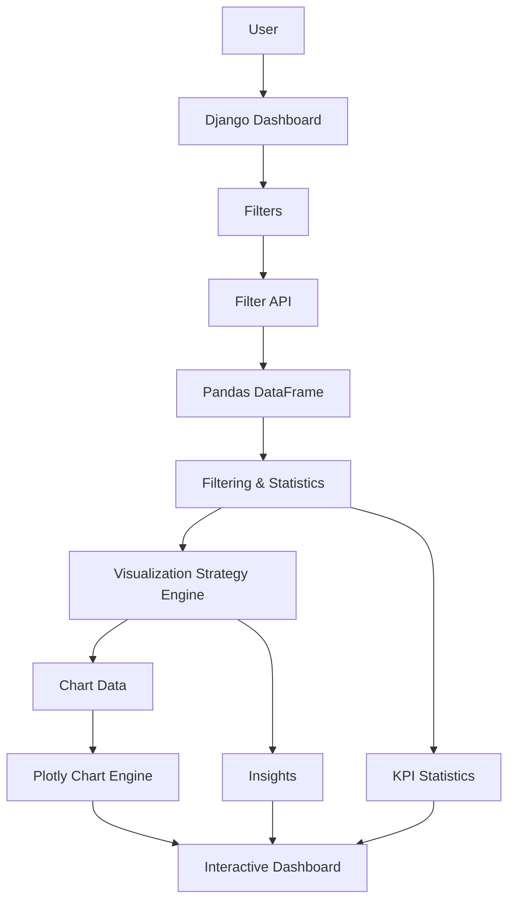

<h1 align = "center" margin = 0>🦈 Shark Tank Analysis Dashboard </h1>

<div align="center">

### Explore the Deals. Understand the Sharks. Find the Patterns.

An interactive Django dashboard for exploring **1,441 Shark Tank US pitches across 53 attributes** with dynamic filtering, Plotly visualizations, Shark analysis, and context-aware insights.

[](https://www.python.org/)
[](https://www.djangoproject.com/)
[](https://pandas.pydata.org/)
[](https://plotly.com/)

</div>

---

## 📌 Overview

This project turns Shark Tank data into an interactive analytics experience.

Instead of presenting a fixed collection of charts, the dashboard **changes its analysis based on the user's filters**. Select seasons, industries, Sharks, or deal status and the backend dynamically determines the most relevant statistics, visualizations, and insights.

> **Don't build more charts. Build better questions.**

---

## ✨ Features

- 📊 Interactive analytics dashboard
- 🔎 Multi-dimensional filtering
- 🦈 Individual Shark analysis
- 📈 Interactive Plotly charts
- 🧠 Context-aware visualization strategy
- 💡 Automatically generated insights
- ⚡ AJAX-based dashboard updates
- 📱 Responsive chart layout
- 📓 Exploratory Jupyter analysis
- 🧹 Pandas-based data processing

### Available Filters

- Season
- Industry
- Shark
- Deal Status

---

## 🧠 Smart Visualization Engine

The project's main differentiator is the **Visualization Strategy Engine** in:

```text
dashboard/data_engine.py
```

It evaluates the current dataset and filter context before deciding what analytical visualizations should be displayed.

### Analysis Modes

| Mode | Context |
|---|---|
| `overview` | No category filter |
| `comparison` | Multiple selections |
| `deep_dive` | Single selection |

The engine can consider:

- dataset size
- filter depth
- trends
- rankings
- distributions
- correlations
- comparisons
- insight opportunities

This keeps the dashboard useful even when the user moves from a broad overview to a highly filtered dataset.

---

## 📊 What You Can Analyze

The dashboard helps answer questions such as:

- Which industries receive the most deals?
- Which Sharks invest the most?
- How does deal activity change by season?
- How much money is invested?
- How do asking amounts compare with actual deals?
- Which industries have stronger deal rates?
- How do Sharks compare with each other?
- How does valuation change between the ask and final deal?
- What patterns appear after applying different filters?

---

## 🏗️ Architecture



### Data Flow

```text
CSV Dataset
    ↓
Pandas
    ↓
Cleaning & Normalization
    ↓
User Filters
    ↓
Statistics + Visualization Strategy
    ↓
JSON Response
    ↓
JavaScript
    ↓
Plotly Dashboard
```

---

## 🗂️ Project Structure

```text
graphy/
│
├── dashboard/
│   ├── data_engine.py
│   ├── utils.py
│   ├── views.py
│   ├── urls.py
│   ├── models.py
│   ├── tests.py
│   │
│   ├── static/
│   │   └── dashboard/
│   │       ├── css/
│   │       └── js/
│   │           └── chart_engine.js
│   │
│   └── templates/
│       └── dashboard/
│           ├── base.html
│           ├── index.html
│           └── shark_analysis.html
│
├── shark_tank_graphy/
│   ├── settings.py
│   ├── urls.py
│   ├── asgi.py
│   └── wsgi.py
│
├── Shark Tank US dataset.csv
├── Shark_tank_Analysis.ipynb
├── manage.py
└── requirements.txt
```

---

## 🛠️ Tech Stack

| Technology | Purpose |
|---|---|
| **Django** | Web application & backend |
| **Pandas** | Data processing |
| **NumPy** | Numerical operations |
| **Plotly** | Interactive visualization |
| **JavaScript** | Dynamic frontend updates |
| **HTML/CSS** | Dashboard UI |
| **SQLite** | Local development database |
| **Jupyter** | Exploratory analysis |

---

## 📦 Dataset

The project uses a Shark Tank US dataset containing:

- **1,441 pitches**
- **53 attributes**

The data includes information about:

- Seasons & episodes
- Startups
- Industries
- Entrepreneurs
- Asking amounts
- Equity
- Valuation
- Deal status
- Investment amounts
- Shark participation
- Shark-specific investments
- Deal structure

---

## 🚀 Getting Started

### 1. Clone

```bash
git clone https://github.com/Sachin-Rawal091/Shark_Tank_Analysis_Dashboard-.git
cd Shark_Tank_Analysis_Dashboard-
```

### 2. Create a virtual environment

**Windows**

```bash
python -m venv .venv
.venv\Scripts\activate
```

**macOS / Linux**

```bash
python3 -m venv .venv
source .venv/bin/activate
```

### 3. Install dependencies

```bash
pip install -r requirements.txt
```

### 4. Run migrations

```bash
python manage.py migrate
```

### 5. Start the server

```bash
python manage.py runserver
```

Open:

```text
http://127.0.0.1:8000/
```

---

## 🔌 API

The dashboard uses a JSON endpoint for dynamic filtering:

```http
POST /api/filter/
```

Example request:

```json
{
  "seasons": [10, 11],
  "industries": ["Food and Beverage"],
  "sharks": ["Mark Cuban"],
  "got_deal": "deals"
}
```

The response contains the information required to update:

```text
Statistics
Charts
Insights
```

without reloading the entire page.

---

## 📓 Exploratory Analysis

The repository also contains:

```text
Shark_tank_Analysis.ipynb
```

The notebook provides the exploratory foundation for the dashboard, including:

- Dataset exploration
- Descriptive statistics
- Season analysis
- Industry analysis
- Deal analysis
- Investment analysis
- Shark comparisons
- Valuation analysis
- Visualization experiments

The project therefore evolves from:

```text
Exploratory Data Analysis
        ↓
Reusable Data Logic
        ↓
Interactive Web Dashboard
```

---

## 🎯 Why This Project?

This project demonstrates how raw data can be transformed into a complete analytics product.

It combines:

- Data Science
- Backend Development
- Frontend Development
- Data Visualization
- API Design
- Analytical UX

The key idea is simple:

> **A dashboard should adapt to the question being asked.**

---

## 🤝 Contributing

Contributions are welcome.

```bash
git checkout -b feature/your-feature
```

Make your changes, test them, then:

```bash
git add .
git commit -m "feat: describe your change"
git push origin feature/your-feature
```

Open a Pull Request with:

1. What changed
2. Why it changed
3. How it was tested
4. Screenshots for UI changes

---

## ⭐ Support the Project

If you find this project useful, interesting, or helpful for learning **Django, Pandas, Plotly, or data visualization**, consider giving it a ⭐.

Every star helps more people discover the project.

---

## 👨‍💻 Author

**Sachin Rawal**

Built with Python, Django, Pandas, Plotly, and a lot of curiosity about what happens when entrepreneurs walk into the Shark Tank.

---

<div align="center">

### 🦈 Analyze the data. Discover the deals. Understand the Sharks.

**⭐ Star the repository if you like the project.**

</div>
